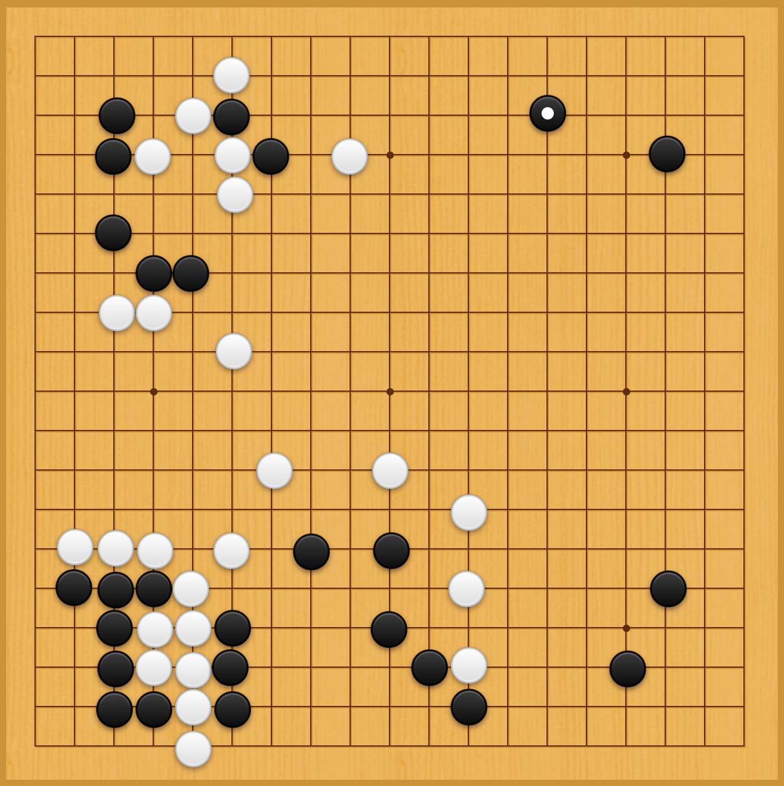

<!-- README.md is generated from README.Rmd. Please edit that file -->

# Chinese Go

Chinese Go is one of the most sophisticated board game in the world.
During the game of Chinese Go, the players have to undergo three stages,
including “the opening”, “The midgame”, and “the endgame”. The players
compete with each other in these three stages in a game of Chinese Go.
After thoughtful consideration of each move, a player who have more
territory finally becomes the winner.

## The analyses

